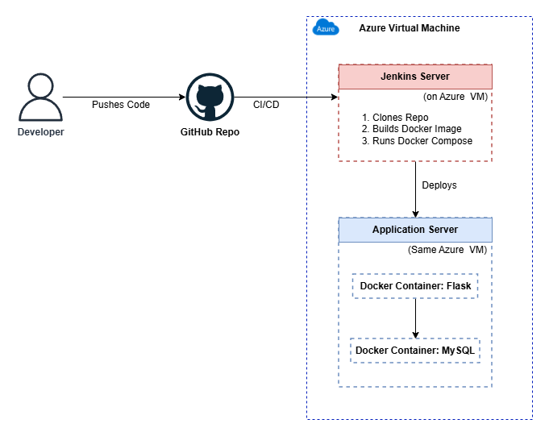
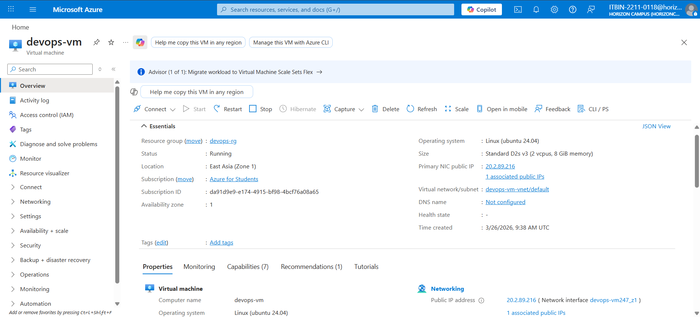
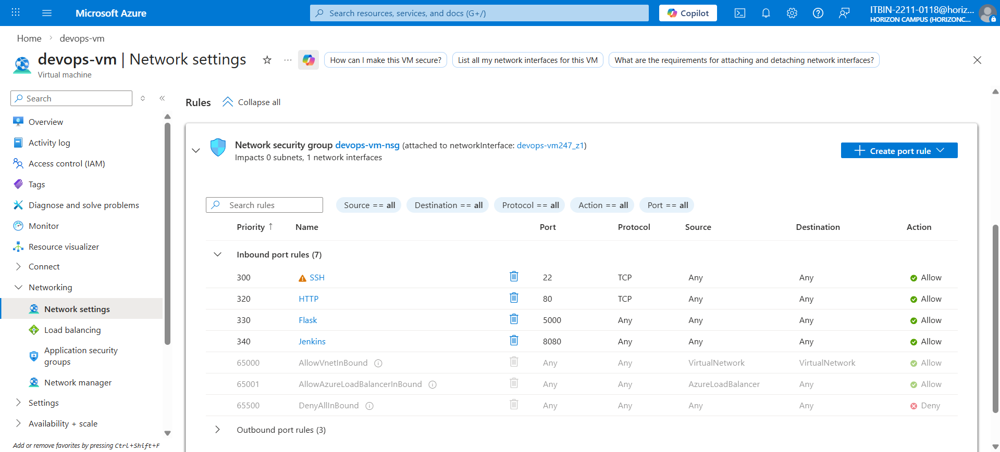
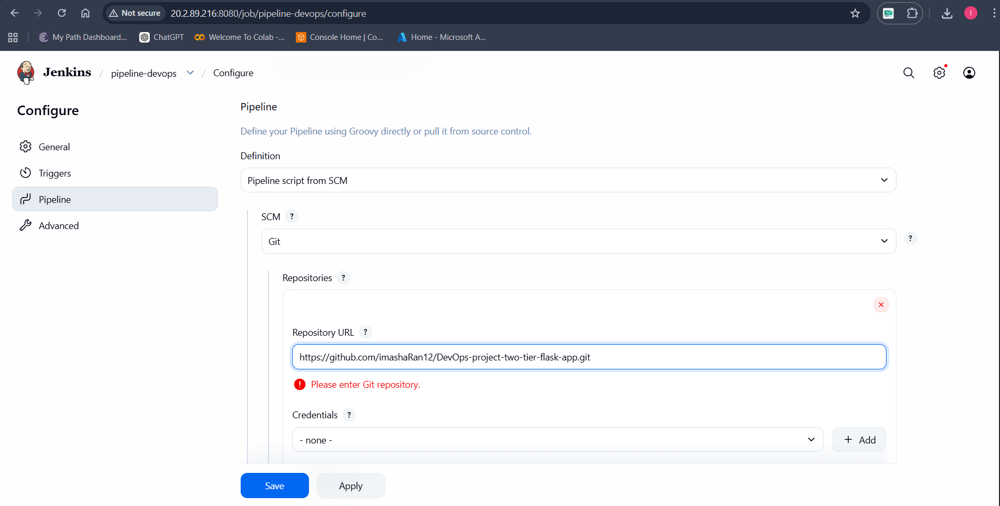
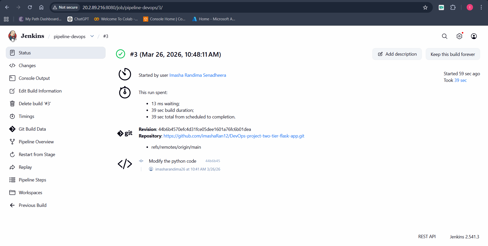
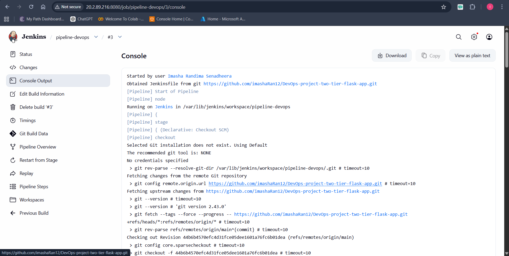
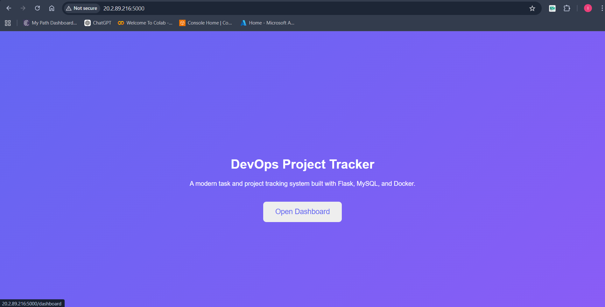
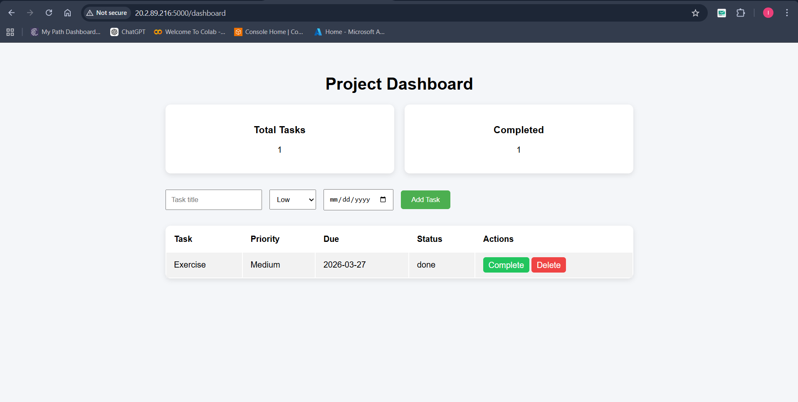
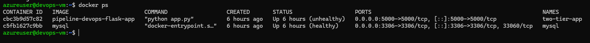
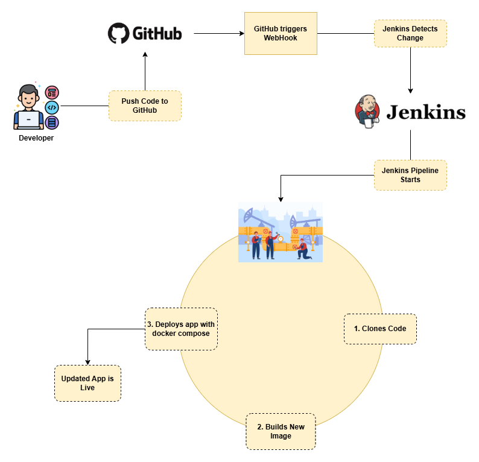

# DevOps Project Report: Automated CI/CD Pipeline for a 2-Tier Flask Application on Azure Cloud

### **Table of Contents**

1. [Project Overview](#1-project-overview)
2. [Architecture Diagram](#2-architecture-diagram)
3. [Step 1: Create Azure Virtual Machine](#3-step-1-create-azure-virtual-machine)
4. [Step 2: Install Dependencies on VM](#4-step-2-install-dependencies-on-vm)
5. [Step 3: Jenkins Installation and Setup](#5-step-3-jenkins-installation-and-setup)
6. [Step 4: GitHub Repository Configuration](#6-step-4-github-repository-configuration)
   - [Dockerfile](#dockerfile)
   - [docker-compose.yml](#docker-composeyml)
   - [Jenkinsfile](#jenkinsfile)
7. [Step 5: Jenkins Pipeline Creation and Execution](#7-step-5-jenkins-pipeline-creation-and-execution)
8. [Conclusion](#8-conclusion)
9. [Work flow Diagram](#10-work-flow-diagram)

---

### **1. Project Overview**

This document outlines the step-by-step process for deploying a 2-tier web application (Flask + MySQL) on an Azure virtual machine. The deployment is containerized using Docker and Docker Compose. A full CI/CD pipeline is established using Jenkins to automate the build and deployment process whenever new code is pushed to a GitHub repository.

---

### **2. Architecture Diagram**



---

### **3. Step 1: Create Azure Virtual Machine**

1.  **Create VM:**
    - Search → Virtual Machines.
    - Click Create → Virtual Machine.

    **Basic Settings:**
    - Select or create new resource group.
    - Choose a Region and based on the region fill Availability options, and Availability zone.
    - Select the image as **Ubuntu Server 24.04 LTS**.

    **Authentication:**
    - Select authentication type as SSH public key
    - Give a Username and Generate new key pair.
    - Give a Key pair name.

    **Inbound Port rules**
    - In select inbound ports check the SSH (22), HTTP (80).
    - Click Review + create.



2.  **Configure Networking (Security Group):**
    - Go to your new created VM → Networking → Network settings → Rules → Create port rule → Inbound Port Rule
      - **Type:** Custom TCP, **Protocol:** TCP, **Port:** 5000 (for Flask), **Source:** Anywhere (0.0.0.0/0)
      - **Type:** Custom TCP, **Protocol:** TCP, **Port:** 8080 (for Jenkins), **Source:** Anywhere (0.0.0.0/0)



3.  **Connect to VM:**
    - Open the terminal on your pc.
    - Use SSH to connect to the instance's public IP address.
    ```bash
    ssh -i /path/to/your-key.pem <username-authentication>@<public-ip-vm>
    ```

---

### **4. Step 2: Install Dependencies on VM**

1.  **Update System Packages:**

    ```bash
    sudo apt update && sudo apt upgrade -y
    ```

2.  **Install Git, Docker, and Docker Compose:**

    ```bash
    sudo apt install git docker.io docker-compose-v2 -y
    ```

3.  **Start and Enable Docker:**

    ```bash
    sudo systemctl start docker
    sudo systemctl enable docker
    ```

4.  **Add User to Docker Group (to run docker without sudo):**
    ```bash
    sudo usermod -aG docker $USER
    newgrp docker
    ```

---

### **5. Step 3: Jenkins Installation and Setup**

1.  **Install Java (OpenJDK 21):**

    ```bash
    sudo apt install fontconfig openjdk-21-jre
    ```

2.  **Add Jenkins Repository and Install:**

    ```bash
    sudo wget -O /etc/apt/keyrings/jenkins-keyring.asc \ https://pkg.jenkins.io/debian-stable/jenkins.io-2026.key
    echo "deb [signed-by=/etc/apt/keyrings/jenkins-keyring.asc]" \ https://pkg.jenkins.io/debian-stable binary/ | sudo tee \
     /etc/apt/sources.list.d/jenkins.list > /dev/null
    sudo apt update
    sudo apt install jenkins
    ```

3.  **Start and Enable Jenkins Service:**

    ```bash
    sudo systemctl start jenkins
    sudo systemctl enable jenkins
    ```

4.  **Initial Jenkins Setup:**
    - Retrieve the initial admin password:
      ```bash
      sudo cat /var/lib/jenkins/secrets/initialAdminPassword
      ```
    - Access the Jenkins dashboard at `http://<public-ip-vm>:8080`.
    - Paste the password, install suggested plugins, and create an admin user.

5.  **Grant Jenkins Docker Permissions:**

    ```bash
    sudo usermod -aG docker jenkins
    sudo systemctl restart jenkins
    ```

6.  **Create Admin User**
    - Fill the details username, password, full name.

---

### **6. Step 4: GitHub Repository Configuration**

Ensure your GitHub repository contains the following three files.

#### **Dockerfile**

This file defines the environment for the Flask application container.

```dockerfile
# Use an official Python runtime as a parent image
FROM python:3.9-slim

# Set the working directory in the container
WORKDIR /app

# Install system dependencies required for mysqlclient
RUN apt-get update && apt-get install -y gcc default-libmysqlclient-dev pkg-config && \
    rm -rf /var/lib/apt/lists/*

# Copy the requirements file to leverage Docker cache
COPY requirements.txt .

# Install Python dependencies
RUN pip install --no-cache-dir -r requirements.txt

# Copy the rest of the application code
COPY . .

# Expose the port the app runs on
EXPOSE 5000

# Command to run the application
CMD ["python", "app.py"]
```

#### **docker-compose.yml**

This file defines and orchestrates the multi-container application (Flask and MySQL).

```yaml
version: "3.8"

services:
  mysql:
    container_name: mysql
    image: mysql
    environment:
      MYSQL_ROOT_PASSWORD: "root"
      MYSQL_DATABASE: "devops"
    ports:
      - "3306:3306"

    volumes:
      - ./init.sql:/docker-entrypoint-initdb.d/init.sql

    networks:
      - two-tier-nt

    restart: always
    healthcheck:
      test: ["CMD", "mysqladmin", "ping", "-h", "localhost", "-uroot", "-proot"]
      interval: 10s
      timeout: 5s
      retries: 5
      start_period: 60s

  flask-app:
    container_name: two-tier-app
    build:
      context: .

    ports:
      - "5000:5000"

    environment:
      - MYSQL_HOST=mysql
      - MYSQL_USER=root
      - MYSQL_PASSWORD=root
      - MYSQL_DB=devops

    networks:
      - two-tier-nt

    depends_on:
      mysql:
        condition: service_healthy

    healthcheck:
      test: ["CMD-SHELL", "curl -f http://localhost:5000/health || exit 1"]
      interval: 10s
      timeout: 5s
      retries: 5
      start_period: 60s

volumes:
  mysql_data:

networks:
  two-tier-nt:
```

#### **Jenkinsfile**

This file contains the pipeline-as-code definition for Jenkins.

```groovy
pipeline {
    agent any
    stages {
        stage('Clone Code') {
            steps {
                // Replace with your GitHub repository URL
                git branch: 'main', url: '<https://github.com/your-username/your-repo.git>'
            }
        }
        stage('Build Docker Image') {
            steps {
                sh 'docker build -t flask-app:latest .'
            }
        }
        stage('Deploy with Docker Compose') {
            steps {
                // Stop existing containers if they are running
                sh 'docker compose down || true'
                // Start the application, rebuilding the flask image
                sh 'docker compose up -d --build'
            }
        }
    }
}
```

---

### **7. Step 5: Jenkins Pipeline Creation and Execution**

1.  **Create a New Pipeline Job in Jenkins:**
    - From the Jenkins dashboard, select **New Item**.
    - Name the project, choose **Pipeline**, and click **OK**.

2.  **Configure the Pipeline:**
    - In the project configuration, scroll to the **Pipeline** section.
    - Set **Definition** to **Pipeline script from SCM**.
    - Choose **Git** as the SCM.
    - Enter your GitHub repository URL.
    - Verify the **Script Path** is `Jenkinsfile`.
    - Save the configuration.



3.  **Run the Pipeline:**
    - Click **Build Now** to trigger the pipeline manually for the first time.
    - Monitor the execution through the **Status** or **Console Output**.




4.  **Verify Deployment:**
    - After a successful build, your Flask application will be accessible at `http://<your-vm-public-ip>:5000`.
      
      
    - Confirm the containers are running on the vm instance with `docker ps`.
      

---

### **8. Conclusion**

The CI/CD pipeline is now fully operational. Any `git push` to the `main` branch of the configured GitHub repository will automatically trigger the Jenkins pipeline, which will build the new Docker image and deploy the updated application, ensuring a seamless and automated workflow from development to production.

---

### **9. Work flow Diagram**



---
